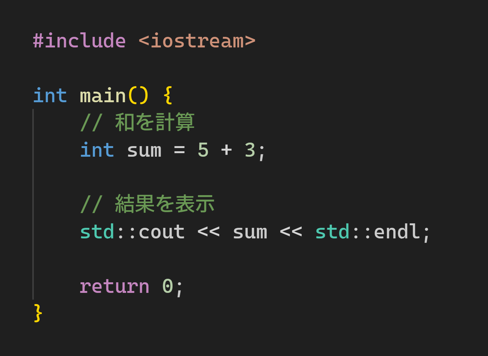
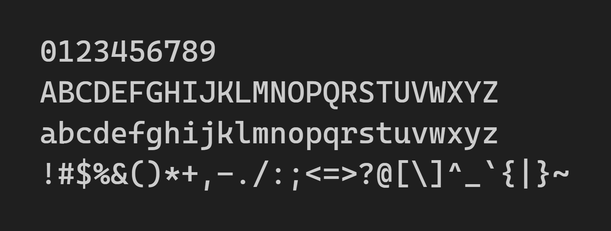

# Calex Code JP

Calex Code JPは、日本語に対応したプログラミング用フォントです。

英数字に [Cascadia Mono Regular](https://github.com/microsoft/cascadia-code) を、日本語に [IBM Plex Sans JP Medium](https://github.com/IBM/plex) を使用したフォントです。

## スクリーンショット

## ライセンス

このフォントはオープンソースであり、SIL Open Font License 1.1の下でライセンスされています。詳細なライセンス条件については、同梱のライセンスファイルをご覧ください。
